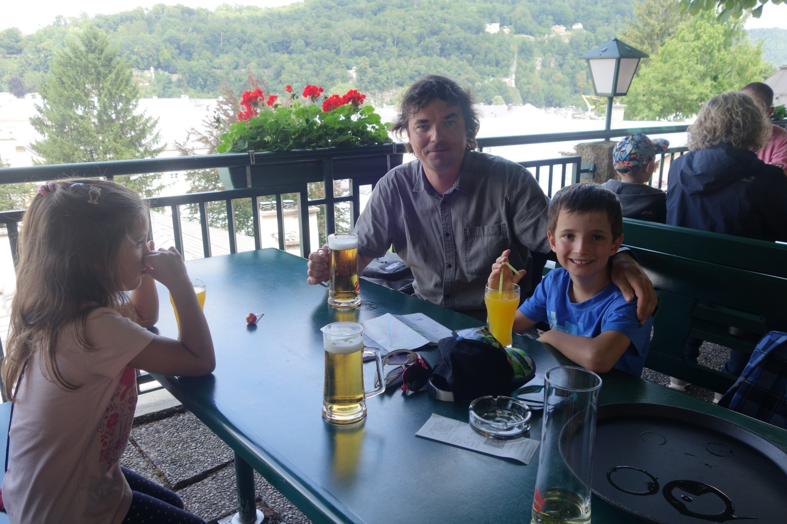

I am an associate professor at the [Department of Linguistics and Baltic Languages](http://www.phil.muni.cz/jazyk/). 

My research focuses on formal and experimental [semantics](https://www.britannica.com/science/semantics). 

